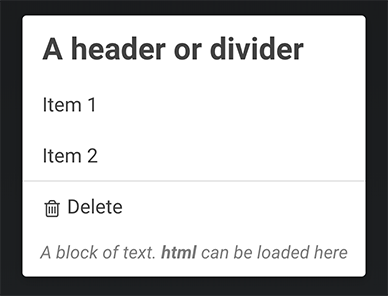

Menu
==========

Creates a menu list that can be loaded in a popover or modal. Supports multiple 
selections, keyboard navigation, search bar, and loadings results via ajax.



# Examples

## Defined Menu
```javascript
let selected = await new Menu([
    {divider: '<h2>A header or divider</h2>'},
    {label: 'Item 1', val: '1'},
    {label: 'Item 2', val: '2'},
    'divider',
    {label: 'Delete', icon: 'trash', val: 'destroy'},
    {text: 'A block of text. <b>html</b> can be loaded here'}
]).popover(element)
```

## AJAX Search

```javascript
let selected = await new Menu([], {
    search: {url: '/my-search-url?term='}
}).popover(element)
```

# Options

## `selected`
Specify which row(s) is selected. Should match `val` in the menu items

## `multiple`
Will let multiple rows be selected. Pressing `esc` key will cancel the selection

### `extras`
A list of extra custom elements to be displayed on each row. Will render after the label.
Each custom element will get `item` set as a property.

## `onSelect`
Lets you hook into when rows are selected; this should be used to mirror selected
results to the UI but final selected values should be retrieved from the 
resolved promise

## `search`
Menu will detect keystrokes and auto scroll to matching rows. However, if you want better (fuzzy)
searching that reduces the results, you can opt to show a search bar.

```javascript
search:true // always show
search:20 // show if 20 or more results
```

Search can also be leveraged to query for results on the server.

```javascript
search: {
    
    // a url is required, it can be a string or a function
    url: 'my-search?term=', // term will be appended to end
    url: term=>'my-search?term='+term, // custom function supported
    showAll: true, // should all results be displayed when nothing is searched

    // a default parser will be used if none given
    // the parsed response should format to expected menu structure
    parse: row=>{
        return {
            label: row.label,
            val: row.val
        }
    }
}
```

## `jumpNav`

You can opt to show an `alphabet-jump-nav`

```javascript
jumpNav: true // always show
jumpNav: 40 // show if 40 or more results
```

# Presenters

After creating a menu, you need to render it some where.
You can use the built-in presenters to accomplish this.

### `menu.modal(opts)`

### `menu.popover(target, opts)`

### Promise based

The presenters return a promise which lets you do this:

```js
async showMenu(){

    let clickedBtn = await menu.modal()

    if( clickedBtn ){
        console.log(clickedBtn) // {label: 'Item 1', val: '1'}
    }
}
```

# Changelog
#### 2019-06-11
- changed how "selected" values are saved
- `multiple` will only take affect when clicking the checkbox, clicking the row will choose that row only
- menu items can have `clearsAll` property set which will be looked at when `multiple` is activated
- adding `extras` feature